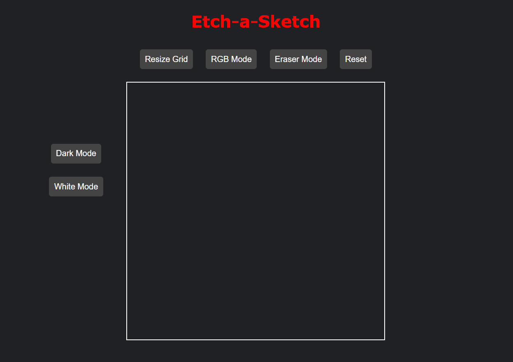
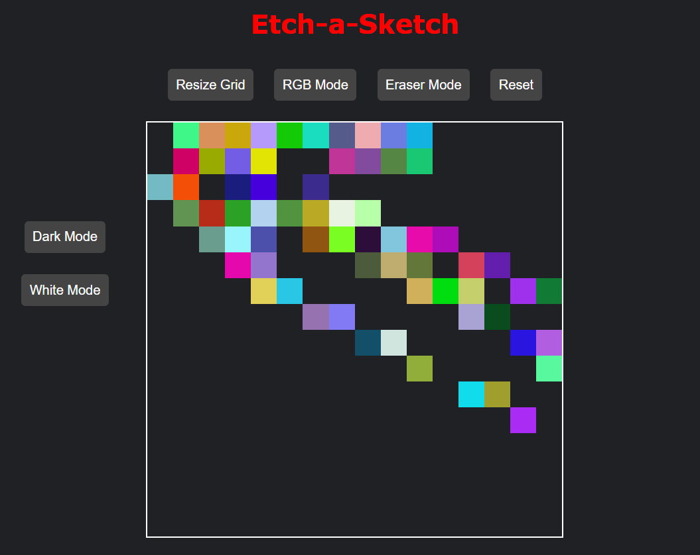

Here’s a **creative and unique** `README.md` file for your **Etch-a-Sketch** project. 🚀  

It’s **engaging, well-structured, and fun** to read while providing all necessary details.  

---

### **🖌️ Etch-a-Sketch: The Digital Doodle Playground 🎨**  

> _“Art is chaos taking shape.”_ – Pablo Picasso  

#### **✨ Welcome to the Future of Sketching!**  

Forget paper. Forget pencils. Welcome to a world where your mouse is the brush, and every pixel is your canvas! **Etch-a-Sketch** is a modern, digital twist on the **classic drawing toy**—but now, it’s powered by your creativity and code! 🖥️🎭  

---

## **🚀 Features That Will Blow Your Mind!**  

🔹 **Dynamic Grid System** – Choose the grid size and sketch with ease.  
🔹 **RGB Mode** – Paint the town (or grid) with random colors! 🌈  
🔹 **Dark Mode & Light Mode** – Switch between themes like a pro! 🌙☀️  
🔹 **Eraser Mode** – Mistake? No worries! Erase it like magic. ✨  
🔹 **Darken Mode** – Add depth by gradually shading your artwork.  
🔹 **Reset Button** – One click and your canvas is fresh again!  

---

## **🎮 How to Play?**  

1️⃣ **Move your mouse** over the grid to start drawing.  
2️⃣ Click the buttons to **switch between modes** (color, eraser, darken, etc.).  
3️⃣ Use the **resize option** to change the grid size anytime.  
4️⃣ Toggle between **Light & Dark Mode** for your preferred experience.  

⚡ _Unleash your creativity, no art degree required!_ 🎨  

---

## **🛠️ Tech Stack**  

💻 **Frontend**: HTML, CSS, JavaScript  
🎨 **CSS Tricks**: Flexbox, Grid, and Custom Styling  
⚡ **JavaScript Magic**: DOM Manipulation & Event Listeners  

---

## **📂 Folder Structure**  

```
/etch-a-sketch
│── /css
│   ├── styles.css    # Beautiful styling for the app
│── /js
│   ├── script.js     # Core logic and interactivity
│── index.html        # Main file bringing everything together
│── README.md         # You’re reading it right now! 📖
```

---

## **💡 Why This Project?**  

This project is **not just about sketching**—it’s an **entry into JavaScript mastery**! From handling events to manipulating the DOM, **this project is your playground to learn and grow as a developer**. 💡  

🎯 **Perfect for:** Beginners, JavaScript enthusiasts, and creative coders who love experimenting!  

---

## 📸 Screenshots

### 🎨 Etch-a-Sketch in Action!


### 🌈 RGB Mode Example



## **📌 Future Enhancements**  

🔹 Save drawings as images  
🔹 Add custom colors & brush sizes  
🔹 Mobile-responsive design  

---

## **🤝 Contributing**  

Got an idea? Found a bug? Want to add a new feature?   
**Contributions are welcome!** Just fork, improve, and create a PR. 🚀  

---

## **💬 Let’s Connect!**  

Made with ❤️ by [Your Name]  

📩 **Have feedback?** Open an issue or reach out!  

🎨 _Now, go sketch something legendary!_ 🖌️✨  

---

This README is **engaging, informative, and fun**—exactly what a great GitHub project deserves! 🚀 Let me know if you want any tweaks! 😃
